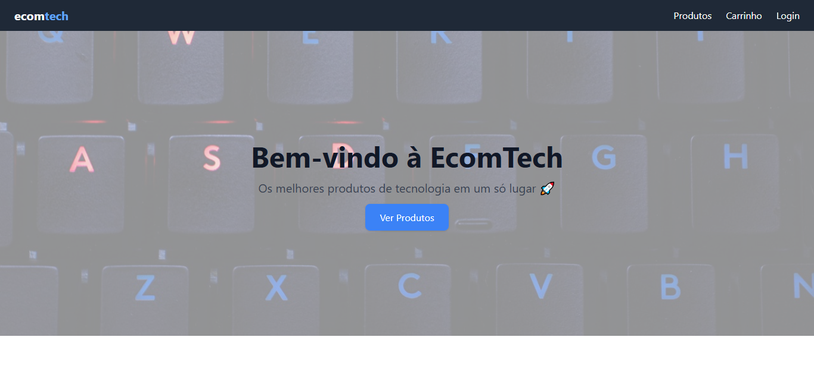
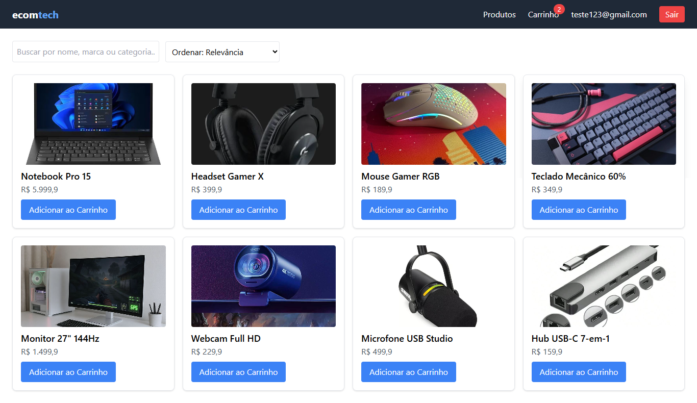
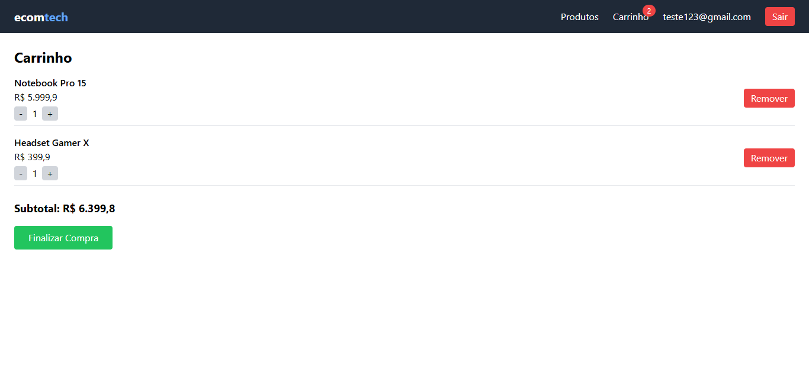

# Loja Virtual

Este projeto simula uma loja online com funcionalidades de login fake, lista de produtos, carrinho com persistência e checkout.

## Funcionalidades
- Login fake com rotas protegidas
- Lista de produtos com busca e ordenação
- Carrinho com persistência no localStorage, +/− e total
- Checkout com confirmação de compra
- Layout responsivo

## 📸 Prints

### Página Inicial

### Lista de Produtos

### Carrinho

## Deploy
Acesse o projeto aqui: [🔗 Clique para ver o site](https://joiceoliveiras.github.io/ecom-tech/)

## Tecnologias
- React + Vite
- React Router
- TailwindCSS
- LocalStorage
